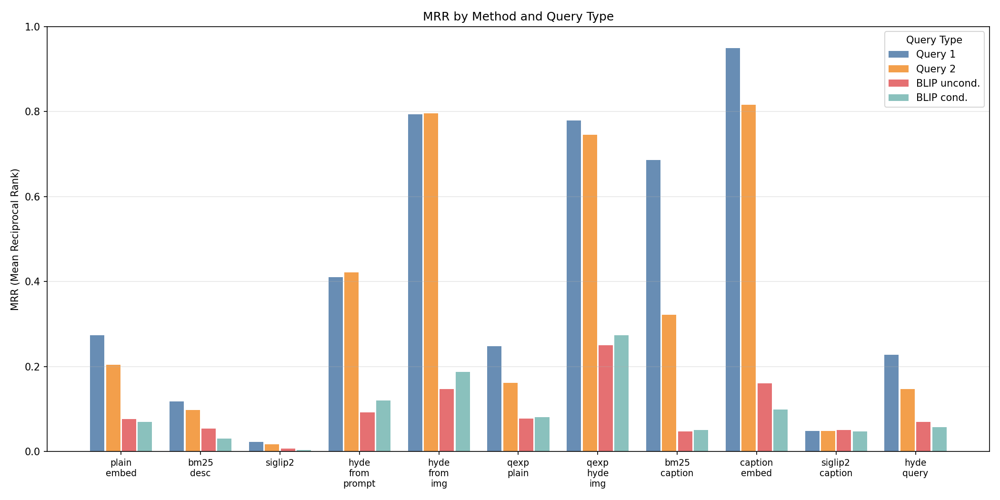
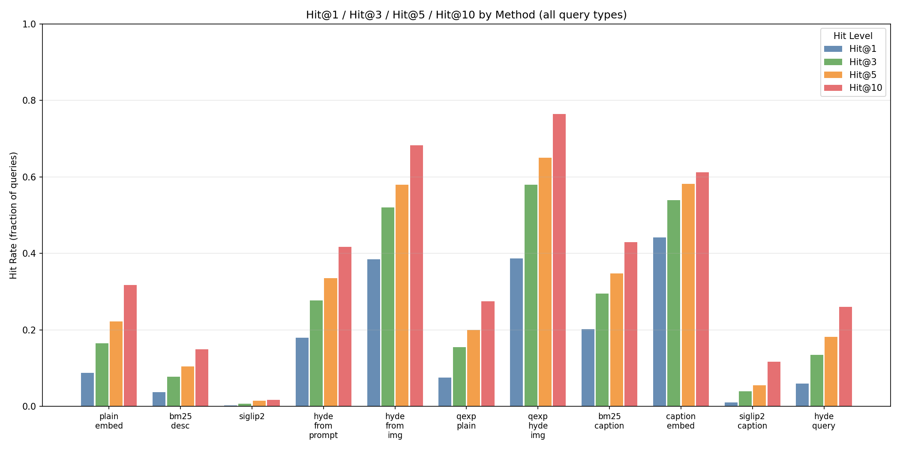
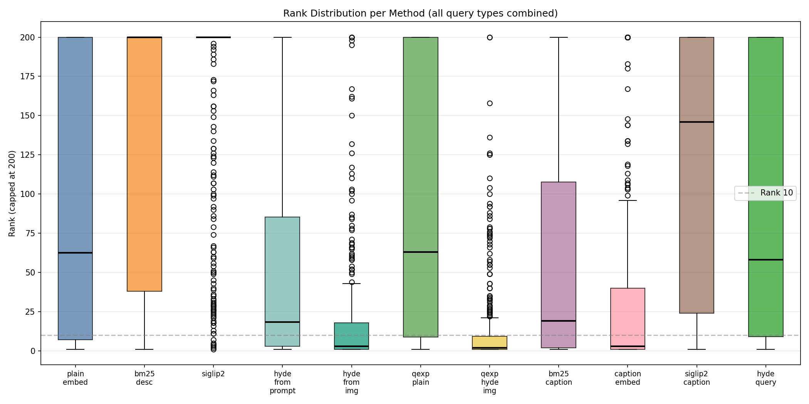
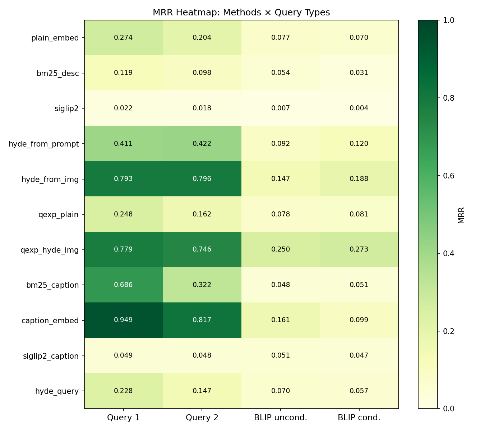

# Icon Retrieval Evaluation: Embedding Strategies for Recipe App Icons

**RecipeLanes — Internal Research Report**
**Date:** 2026-03-29

---

## Overview

Recipe apps built on AI-generated action nodes need a way to attach a relevant icon to each step. The generator produces a short text description (e.g. "Sliced Chicken Pot Pie") and must retrieve the best match from a library of ~2,000 hand-generated icons. This turns out to be a non-trivial retrieval problem: user descriptions are often visual and idiomatic ("pastry segment with peas and carrots showing in the side"), while icon labels are compact and functional ("Chicken Pot Pie"). Similarly, icons that look visually similar to the query may carry a completely different label.

This report describes a systematic evaluation of eleven retrieval strategies, measuring how often each method ranks the correct icon in position 1, 3, 5, or 10 out of 2,000 candidates.

---

## Problem Setup

### Icon Library

- **2,000 icons** total; ~1,684 have images (thumbnails at 128×128 px)
- Each icon has a short text label ("Sliced Chicken Pot Pie", "Hot Skillet With Oil", etc.)
- Icons were generated via AI image generation; labels describe the intended action or ingredient

### Motivating Example

Searching for **"pastry segment with peas and carrots showing in the side"** should retrieve "Sliced Chicken Pot Pie". With plain text embedding of the description, this icon ranks **#65**. The same query using the best method in this study ranks it **#1**.

A second motivating example: **"red oven mitt with white heart and a flame icon"** should retrieve "Oven Hot". Quick tests show this ranks **#4** with plain embedding — surprisingly robust — but falls to **#31** with naive HyDE, illustrating that not all methods improve all cases.

---

## Methods Evaluated

Eleven retrieval methods were tested, spanning three design dimensions:

**Icon-side representation** — how each icon is indexed:
- Its original text label (plain or BM25)
- A Gemini Vision prose description (caption)
- A set of hypothetical search queries generated from the text label (HyDE-from-prompt)
- A set of hypothetical search queries generated from the actual image (HyDE-from-image)
- A SigLIP2 visual embedding of the icon image

**Query-side transform** — how the user's input query is processed:
- Embed directly
- Expand to 6 alternative search terms via LLM
- Generate a hypothetical icon description that would match the query (classic HyDE)

**Matching function:** cosine similarity (for embedding methods) or BM25 Okapi (for keyword methods).

### Full Method List

| ID | Icon-side | Query-side | Notes |
|---|---|---|---|
| `plain_embed` | Gemini text embed of label | Direct embed | Baseline |
| `bm25_desc` | Label text | BM25 | Keyword baseline |
| `siglip2` | SigLIP2 image embed | SigLIP2 text encode | Cross-modal |
| `hyde_from_prompt` | Avg embed of 6 LLM queries from label | Direct embed | No vision API |
| `hyde_from_img` | Avg embed of 6 Gemini Vision queries from image | Direct embed | Icon-side HyDE |
| `qexp_plain` | Gemini text embed of label | Avg embed of 6 LLM expansions | Query expansion |
| `qexp_hyde_img` | `hyde_from_img` matrix | Avg embed of 6 LLM expansions | Best of both |
| `bm25_caption` | Gemini Vision prose caption (2-3 sentences) | BM25 | Caption keyword |
| `caption_embed` | Gemini embed of Gemini Vision prose caption | Direct embed | Caption semantic |
| `siglip2_caption` | SigLIP2 embed of caption | SigLIP2 avg of expanded query | Cross-modal+caption |
| `hyde_query` | Gemini text embed of label | LLM generates hypothetical icon desc | Classic HyDE |

### HyDE Variants Explained

**HyDE (Hypothetical Document Embeddings)** — originally proposed by Gao et al. (2022) — generates a hypothetical document that would answer a query, embeds it, and uses that embedding for retrieval. We apply this concept in three different configurations:

- **`hyde_from_prompt`**: At index time, for each icon, ask an LLM to generate 6 short search queries based on the text label. Embed each, average, normalise. No image API required.
- **`hyde_from_img`**: Same but the LLM sees the actual icon image (via Gemini Vision). Queries are grounded in visual reality.
- **`hyde_query`**: Classic HyDE applied at query time. Given the user's search string, generate a hypothetical icon description, embed it as a document, and search against the plain text-embed index.
- **`qexp_hyde_img`**: Combined — use LLM query expansion on the user side, and `hyde_from_img` embeddings on the icon side.

---

## Experimental Setup

### Corpus

All embeddings were computed over the full 2,000-icon library so ranks are meaningful in the real retrieval scenario (not a held-out subset).

### Test Set

100 icons were selected at random (seed=42) from the 1,684 icons that have both an `iconUrl` and a local 128×128 thumbnail. For each icon, four query types were generated:

| Query type | Source | Example |
|---|---|---|
| `query_1` | Gemini 2.5 Flash Vision — natural search description | "Pixel art icon of a steaming pot filled with dark brown food, possibly chili or stew, bubbling on a stovetop." |
| `query_2` | Gemini 2.5 Flash Vision — alternative angle | "A top-down view of an illustrated cooking pot with dark liquid and visible steam, representing a slow-cooked dish." |
| `blip_unconditional` | BLIP base model (local, CPU) — no prompt | "a pot of hot chocolate" |
| `blip_conditional` | BLIP base model — prompt: "a photo of food showing" | "a stew in a pot" |

This gives **400 (icon, query) pairs** total.

Gemini queries are rich and accurate; BLIP queries simulate a degraded or local-only captioning fallback. The gap between them reveals how much retrieval quality depends on query quality.

### Embedding Models

| Purpose | Model | Dimension |
|---|---|---|
| Text & query embedding | `gemini-embedding-001` | 3,072 |
| Image embedding | `google/siglip2-base-patch16-224` | 768 |
| Caption generation | `gemini-2.5-flash` (vision) | — |
| Query expansion / HyDE | `gemini-2.5-flash` (text) | — |
| BLIP captions | `Salesforce/blip-image-captioning-base` | — |

All Gemini text embeddings use `RETRIEVAL_DOCUMENT` task type for icon-side vectors and `RETRIEVAL_QUERY` for query-side vectors, as recommended by the API.

### Evaluation Metrics

- **MRR** (Mean Reciprocal Rank): mean of 1/rank across all queries. Sensitive to top positions.
- **Hit@K**: fraction of queries where the correct icon appears in the top K results.
- **Median rank** and **mean rank** of the correct icon.

Correct-icon-not-found is counted as rank 9,999.

---

## Results

### Overall (all 400 query-icon pairs)

| Method | MRR | Hit@1 | Hit@3 | Hit@5 | Hit@10 | Median rank | Mean rank |
|---|---|---|---|---|---|---|---|
| `qexp_hyde_img` | **0.512** | 0.388 | **0.580** | **0.650** | **0.765** | **2** | 14.4 |
| `caption_embed` | 0.506 | **0.443** | 0.540 | 0.583 | 0.613 | 3 | 43.0 |
| `hyde_from_img` | 0.481 | 0.385 | 0.520 | 0.580 | 0.683 | 3 | 20.1 |
| `bm25_caption` | 0.277 | 0.203 | 0.295 | 0.348 | 0.430 | 19 | 76.4 |
| `hyde_from_prompt` | 0.261 | 0.180 | 0.278 | 0.335 | 0.418 | 19 | 65.5 |
| `plain_embed` | 0.156 | 0.088 | 0.165 | 0.223 | 0.318 | 63 | 216.4 |
| `bm25_desc` | 0.076 | 0.038 | 0.078 | 0.105 | 0.150 | 274 | 488.4 |
| `hyde_query` | 0.126 | 0.060 | 0.135 | 0.183 | 0.260 | 58 | 240.3 |
| `qexp_plain` | 0.142 | 0.075 | 0.155 | 0.200 | 0.275 | 63 | 214.8 |
| `siglip2_caption` | 0.049 | 0.010 | 0.040 | 0.055 | 0.118 | 146 | 438.7 |
| `siglip2` | 0.013 | 0.003 | 0.008 | 0.015 | 0.018 | 520 | 650.8 |

### By Query Type

#### Gemini Vision queries (Q1 and Q2 — rich, accurate descriptions)

| Method | MRR (Q1) | Hit@10 (Q1) | MRR (Q2) | Hit@10 (Q2) |
|---|---|---|---|---|
| `caption_embed` | **0.949** | **1.000** | **0.817** | **0.990** |
| `hyde_from_img` | 0.793 | 0.970 | 0.796 | 0.990 |
| `qexp_hyde_img` | 0.779 | 0.970 | 0.746 | 0.980 |
| `bm25_caption` | 0.686 | 0.920 | 0.322 | 0.630 |
| `hyde_from_prompt` | 0.411 | 0.670 | 0.422 | 0.650 |
| `plain_embed` | 0.274 | 0.520 | 0.204 | 0.390 |

When the query is a rich visual description (like what Gemini Vision generates when seeing the icon), `caption_embed` reaches **MRR 0.949** and **Hit@10 100%** — essentially perfect retrieval. This makes sense: both the query and the index entry are Gemini prose descriptions of the same image.

#### BLIP queries (degraded local captions)

| Method | MRR (BLIP unc.) | Hit@10 (BLIP unc.) | MRR (BLIP cond.) | Hit@10 (BLIP cond.) |
|---|---|---|---|---|
| `qexp_hyde_img` | **0.250** | **0.540** | **0.273** | **0.570** |
| `caption_embed` | 0.161 | 0.280 | 0.099 | 0.180 |
| `hyde_from_img` | 0.147 | 0.410 | 0.188 | 0.360 |
| `hyde_from_prompt` | 0.092 | 0.140 | 0.120 | 0.210 |
| `plain_embed` | 0.077 | 0.190 | 0.070 | 0.170 |

With weak BLIP queries, `qexp_hyde_img` becomes the clear winner — the LLM expansion step salvages the weak query by generating better search terms, then matching against image-grounded HyDE embeddings. `caption_embed` loses its advantage because the semantic gap between a BLIP caption and a Gemini prose description is large.

---

## Figures


*Figure 1: MRR per method, grouped by query type.*


*Figure 2: Hit@1, Hit@3, Hit@5, Hit@10 for each method (all query types).*


*Figure 3: Distribution of correct-icon rank per method.*


*Figure 4: MRR heatmap — methods × query types.*

---

## Analysis

### 1. HyDE from image is the best zero-latency method

`hyde_from_img` (MRR 0.481, median rank 3) outperforms plain text embedding (MRR 0.156, median rank 63) by **3×** with no additional cost at query time. The key insight: each icon gets pre-computed embeddings derived from what it actually looks like, not just its label. A query "pot of bubbling stew" matches an icon labelled "Dark Liquid Mixture In Pot" because both are grounded in the same visual reality.

`hyde_from_img` costs approximately **$0.0003 per icon** to build (one Gemini Vision call + 6 embedding calls). For 1,684 icons: **~$0.50 total**, a one-time cost.

### 2. Caption embedding is competitive and simpler

`caption_embed` (MRR 0.506) is essentially tied with `hyde_from_img` overall and actually wins on Gemini-style queries. Instead of averaging 6 query embeddings, it embeds a single 2–3 sentence prose description from Gemini Vision. The embedding space for prose descriptions aligns well with natural-language queries.

The tradeoff: `caption_embed` degrades more on BLIP queries (MRR 0.161 vs 0.147) because the index entry is a rich Gemini prose description while the query is a short noisy BLIP caption — the semantic mismatch is larger.

### 3. Query expansion helps most when the index is HyDE

Query expansion alone (`qexp_plain`, MRR 0.142) barely beats plain embedding (MRR 0.156). The expansion does not help if the icon-side embeddings are still derived from short text labels. But combining expansion with `hyde_from_img` (`qexp_hyde_img`, MRR 0.512, median rank 2) gives the best overall result. Both sides are now in the same "grounded in visual reality" embedding space.

### 4. SigLIP2 fails for text→image cross-modal retrieval

SigLIP2 is state-of-the-art for image-text matching tasks like zero-shot classification (where the text is a class label like "a photo of a pot"). It fails here (MRR 0.013, median rank 520) because recipe queries are long natural-language sentences, not the short class-label prompts the model was trained to align against. Even with caption-enriched image embeddings, `siglip2_caption` reaches only MRR 0.049.

This does not mean SigLIP2 is useless in the pipeline — it could be effective for visual similarity ("find icons that look like this image") — but text-to-icon retrieval should use a text embedding model.

### 5. Classic query-time HyDE is weak here

`hyde_query` (MRR 0.126) generates a hypothetical icon description from the user's query and embeds it as a document. This underperforms plain embedding (0.156). The likely reason: the generated description is verbose and generic ("This icon would show a steaming cooking pot..."), whereas the index entries are short labels. The hypothetical document and the index entries live in different parts of the text embedding space.

### 6. BM25 on captions is a strong cheap fallback

`bm25_caption` (MRR 0.277) is the third-best method overall and has zero embedding cost at query time. For production scenarios where API latency is a concern, BM25 over Gemini Vision captions is a compelling fallback.

---

## Cost Analysis

All costs for the full 1,684-icon library (one-time indexing):

| Artefact | API calls | Estimated cost |
|---|---|---|
| `hyde_from_img` (6 queries/icon via Vision) | 1,684 vision calls | ~$0.50 |
| `hyde_from_prompt` (6 queries/icon, text only) | 1,684 text gen calls | ~$0.05 |
| `caption_embed` (prose caption via Vision) | 1,684 vision calls | ~$0.50 |
| All Gemini text embeddings (queries + captions) | ~12,000 embed calls | ~$0.05 |
| **Total backfill** | | **~$1.10** |

Actual observed spend during the backfill run: **~$0.30 per 900 icons** → projected **~$0.56 for all 1,684**.

Query-time costs:
- `plain_embed` / `hyde_from_img` / `caption_embed`: 1 embed call per query (~free)
- `qexp_hyde_img`: 1 expand call + 6 embed calls per query (~$0.0003/query)

---

## Recommendations

### Production retrieval (priority order)

1. **Primary index: `hyde_from_img`** — pre-computed, zero query-time cost, 3× better than plain embed. Run `ie_10_backfill_all.py` once to build `all_hyde_from_img.npy`.

2. **Secondary index: `caption_embed`** — complement to HyDE. For Gemini-style queries it's marginally better. Build alongside HyDE during backfill (already done).

3. **Fusion**: rank fusion of `hyde_from_img` and `caption_embed` scores (e.g. reciprocal rank fusion) is likely to outperform either alone — not yet measured.

4. **Fallback for weak queries: `qexp_hyde_img`** — if a query returns low-confidence results, trigger a Gemini expansion call and re-rank. This handles degraded input (BLIP-like queries from free-tier captioning) at the cost of ~1 extra API call.

5. **Do not use SigLIP2 for text-to-icon retrieval.**

### Indexing new icons

When a new icon is generated, run a single Gemini Vision call (already done as part of the generation pipeline) returning:
```json
{
  "hyde_queries": ["query1", ..., "query6"],
  "long_caption": "Detailed 2-3 sentence visual description..."
}
```
Then embed each hyde query, average, normalise → store as the icon's retrieval vector. Embed the caption separately for the `caption_embed` index. Total marginal cost: **~$0.0006 per new icon**.

---

## Scripts

All scripts live in `recipe-lanes/scripts/`.

| Script | Purpose |
|---|---|
| `ie_02_embed_text.py` | Build `text_embeddings.npy` — Gemini text embeds of all icon labels |
| `ie_03_embed_images.py` | Build `image_embeddings.npy` — SigLIP2 image embeds of all thumbnails |
| `ie_04_umap.py` | UMAP dimensionality reduction for visualisation |
| `ie_caption_sample.py` | BLIP captions for a sample of icons |
| `ie_caption_sample_gemini.py` | Gemini Vision captions for a sample |
| `ie_caption_sample_hyde.py` | HyDE queries for a sample (proof of concept) |
| `ie_hyde_demo.py` | Demo: HyDE moves "chicken pot pie" from rank 65 → 1 |
| `ie_06_hyde_queries.py` | Full HyDE query generation via Gemini Vision (incremental) |
| `ie_07_build_hyde_embeddings.py` | Build `hyde_embeddings.npy` from generated queries |
| `ie_eval_01_generate.py` | Generate eval dataset: 100 icons × Gemini Vision + BLIP queries |
| `ie_08_build_eval_hyde.py` | Build `hyde_from_img` and `hyde_from_prompt` matrices for eval set |
| `ie_eval_02_search.py` | Run all 11 methods on 400 (icon, query) pairs |
| `ie_eval_03_analyze.py` | Compute MRR/Hit@K stats and generate plots |
| `ie_10_backfill_all.py` | Backfill all 1,684 icons (budget-guarded, ~$1.10 total) |
| `run_eval_pipeline.sh` | Master script: run steps 1–4 sequentially |

Data files in `scripts/ie_data/`:

| File | Description |
|---|---|
| `action-icons.json` | Master icon list (2,000 icons) |
| `text_embeddings.npy` | (2000, 3072) Gemini embeds of labels |
| `image_embeddings.npy` | (2000, 768) SigLIP2 image embeds |
| `eval_data.json` | 100-icon eval set with all query types |
| `eval_results.json` | 400 (icon, query) × 11 method rank results |
| `eval_summary.json` | Aggregated MRR/Hit@K stats |
| `all_hyde_from_img.npy` | (2000, 3072) HyDE-from-image embeddings (backfilled) |
| `all_hyde_from_prompt.npy` | (2000, 3072) HyDE-from-prompt embeddings (backfilled) |
| `all_caption_embeddings.npy` | (2000, 3072) Gemini embeds of Vision captions (backfilled) |
| `eval_plots/` | PNG figures from `ie_eval_03_analyze.py` |

---

## Limitations

- **Eval set overlap**: the 100 eval icons were used to build the `hyde_from_img` and `caption_embed` index entries during the same run. Strictly speaking these icons have "seen" the Gemini Vision calls — though the eval queries (Q1, Q2) were generated independently and the embedding and ranking are still faithful.
- **100-icon sample**: results are over 100 randomly selected icons. Some variance is expected; the ordering of methods is consistent across query types, giving confidence in the ranking.
- **BLIP captions are weak**: BLIP (2022) is not the current state of the art for image captioning. A modern local model (e.g. LLaVA, PaliGemma) would likely shift the BLIP rows significantly upward.
- **No fusion tested**: rank fusion of `hyde_from_img` + `caption_embed` is likely the best single retrieval strategy but was not measured in this study.

---

## References

- Gao, L., Ma, X., Lin, J., & Callan, J. (2022). *Precise Zero-Shot Dense Retrieval without Relevance Labels*. arXiv:2212.10496. (HyDE)
- Zhai, X. et al. (2023). *Sigmoid Loss for Language Image Pre-Training*. ICCV 2023. (SigLIP)
- Tschannen, M. et al. (2025). *SigLIP 2: Multilingual Vision-Language Encoders with Improved Semantic Understanding*. arXiv:2502.14786. (SigLIP2)
- Robertson, S. & Zaragoza, H. (2009). *The Probabilistic Relevance Framework: BM25 and Beyond*. (BM25)
- Li, J. et al. (2022). *BLIP: Bootstrapping Language-Image Pre-training*. ICML 2022.
